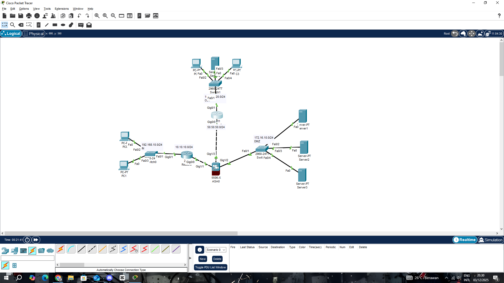
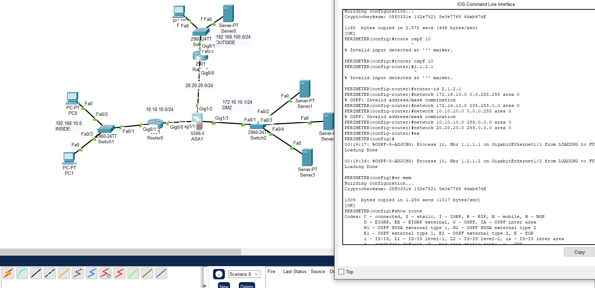
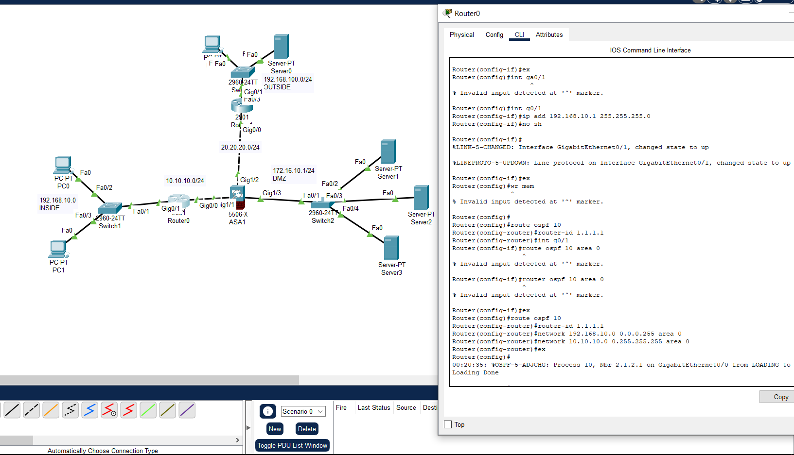
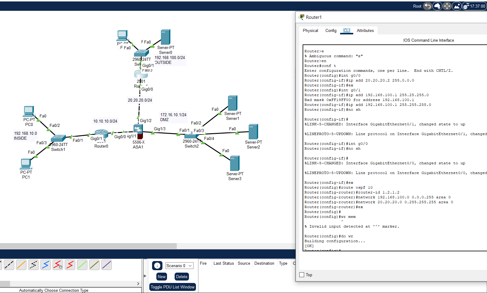

---

# 🌐 Enterprise Network Security Infrastructure

## Multi-Zone Cisco ASA Firewall with OSPF Routing Protocol

<div align="center">


**Advanced enterprise-grade segmented network with ASA firewall, OSPF backbone, and multi-zone isolation.**

[Topology](#-network-topology) • [Security Zones](#-security-architecture) • [Config Guide](#-complete-configuration-guide) • [OSPF](#-ospf-configuration)

</div>

---

## 📋 Executive Summary

This project implements a **Cisco ASA 5506-X** firewall with **OSPF Area 0**, a **DMZ**, and **multi-segment security architecture**.
The topology simulates an enterprise environment with an internal LAN, a DMZ server farm, and an OUTSIDE zone connected to the OSPF backbone.

---

## 🖼️ Network Topology

### Complete Topology



---

## 🔐 Security Architecture

### Zone Hierarchy

<div align="center">

| Zone       | Interface | Security Level | Description                    |
| ---------- | --------- | -------------- | ------------------------------ |
| 🟢 INSIDE  | Gi1/1     | 100            | Internal LAN / User network    |
| 🟡 DMZ     | Gi1/2     | 50             | Server farm                    |
| 🔴 OUTSIDE | Gi1/3     | 0              | External network / OSPF uplink |

</div>

---

## 🌍 Network Segments

### **INSIDE (192.168.10.0/24)**

* Gateway: **192.168.10.1 (ASA Gi1/1)**
* Devices: PC0, PC1, Switch1

### **DMZ (172.16.10.0/24)**

* Gateway: **172.16.10.1 (ASA Gi1/2)**
* Servers: Server1, Server2, Server3

### **OUTSIDE (192.168.100.0/24)**

* Gateway: **192.168.100.1 (ASA Gi1/3)**
* Connected to Router0 (OSPF Edge)

### **OSPF Backbone (20.20.20.0/24)**

* Router0 ↔ Router1 ↔ Router2
* Area 0

---

## 🔧 Complete Configuration Guide

# 🔥 Part 1 — Cisco ASA Configuration



---

### **Step 1 — Interface Setup**

```cisco
interface GigabitEthernet1/1
 nameif inside
 security-level 100
 ip address 192.168.10.1 255.255.255.0
 no shutdown

interface GigabitEthernet1/2
 nameif dmz
 security-level 50
 ip address 172.16.10.1 255.255.255.0
 no shutdown

interface GigabitEthernet1/3
 nameif outside
 security-level 0
 ip address 192.168.100.1 255.255.255.0
 no shutdown
```

---

### **Step 2 — OSPF Routing (Replaces Static Routes)**

*(Static routes removed — ASA now participates in OSPF)*

```cisco
router ospf 10
 router-id 2.1.2.1
 network 192.168.10.0 255.255.255.0 area 0
 network 172.16.10.0 255.255.255.0 area 0
 network 192.168.100.0 255.255.255.0 area 0
```

---

### **Step 3 — NAT Rules**

```cisco
object network INSIDE-NETWORK
 subnet 192.168.10.0 255.255.255.0
 nat (inside,outside) dynamic interface

object network DMZ-NETWORK
 subnet 172.16.10.0 255.255.255.0
 nat (dmz,outside) dynamic interface
```

---

### **Step 4 — ICMP & ACL Fix (From ACL&FIX.txt)**

#### ICMP Inspection

```cisco
conf t
policy-map global_policy
 class inspection_default
  inspect icmp
```

#### ACL Rules

```cisco
access-list INSIDE-IN extended permit icmp any any
access-list DMZ-IN extended permit icmp any any
access-list OUTSIDE-IN extended permit icmp any any

access-group INSIDE-IN in interface inside
access-group DMZ-IN in interface dmz
access-group OUTSIDE-IN in interface outside
```

---

# 🔄 Part 2 — Router Configurations

---

## **Router0 (LAN ↔ ASA ↔ OSPF)**



```cisco
interface g0/0
 ip address 10.10.10.1 255.255.255.0
 no shutdown

interface g0/1
 ip address 192.168.100.254 255.255.255.0
 no shutdown

router ospf 10
 router-id 1.1.1.1
 network 10.10.10.0 0.0.0.255 area 0
 network 192.168.100.0 0.0.0.255 area 0
 passive-interface g0/1
```

---

## **Router1 (Backbone Router)**

```cisco
interface g0/0
 ip address 20.20.20.2 255.255.255.0
 no shutdown

interface g0/1
 ip address 10.10.10.1 255.255.255.0
 no shutdown

router ospf 10
 router-id 2.2.2.2
 network 10.10.10.0 0.0.0.255 area 0
 network 20.20.20.0 0.0.0.255 area 0
 passive-interface g0/1
```

---

## **Router2 (Default Route Origin / Internet Simulation)**

```cisco
interface g0/0
 ip address 20.20.20.3 255.255.255.0
 no shutdown

interface g0/1
 ip address 50.50.50.3 255.255.255.0
 no shutdown

router ospf 10
 router-id 3.3.3.3
 network 20.20.20.0 0.0.0.255 area 0
 default-information originate

ip route 0.0.0.0 0.0.0.0 50.50.50.1
```

---

# 📡 OSPF Configuration Summary

```yaml
Process ID:       10
Area:             0
Routers:          3
Hello Interval:   10 seconds
Dead Interval:    40 seconds
Network Type:     Broadcast
```

---

# 🧪 Testing & Verification

## Successful ICMP Tests After ACL Fix


---

# 📚 Final Notes

* The ASA now fully relies on **OSPF dynamic routing**, avoiding static route conflicts.
* ICMP inspection and ACLs are required to ensure successful ping tests across all zones.
* All configurations match the provided Packet Tracer topology and CLI outputs.

---
