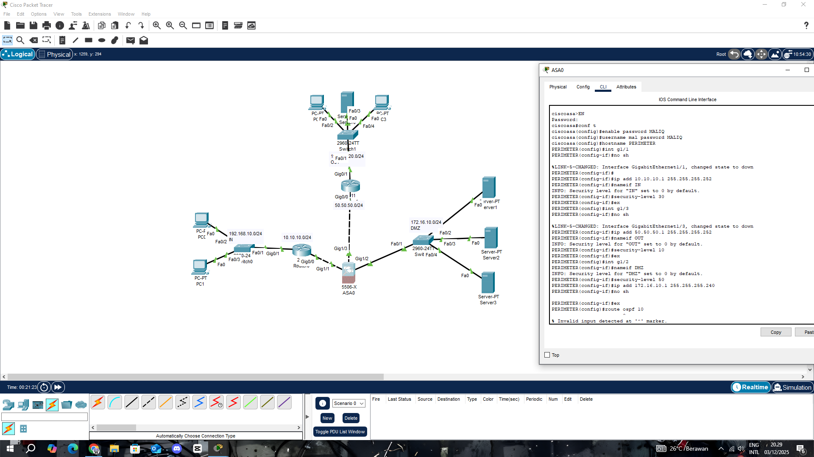
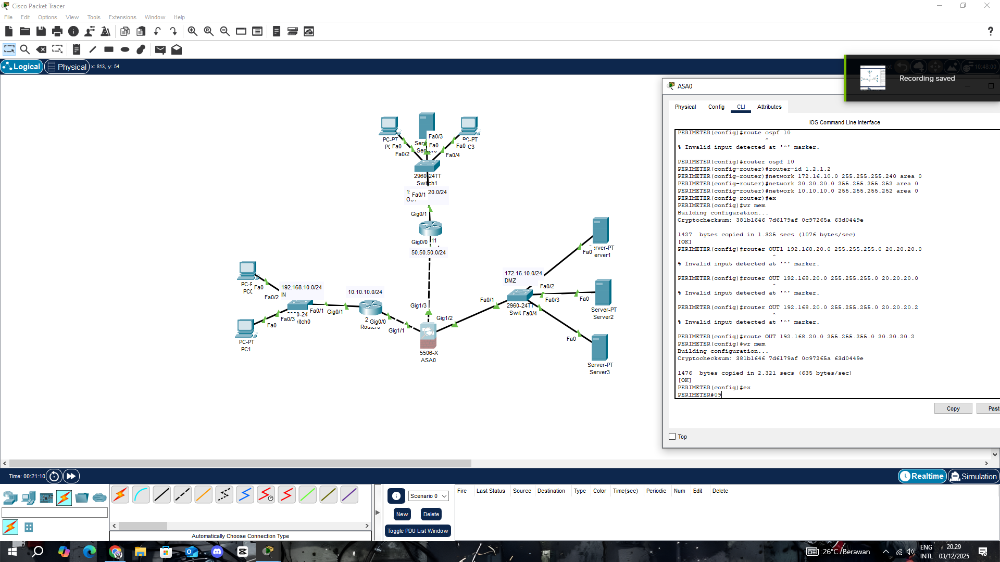

Saya akan membantu memperbaiki README dengan konfigurasi IP yang benar. Berikut adalah versi yang sudah diperbarui:

# 🌐 Enterprise Network Security Infrastructure
## Multi-Zone Cisco ASA Firewall with OSPF Routing Protocol

<div align="center">


**Advanced enterprise-grade network architecture with zone-based firewall and dynamic routing**

*Complete implementation of ASA security appliance with OSPF protocol integration, multi-segment architecture, and DMZ isolation*

[View Topology](#-network-topology) • [Configuration Guide](#-complete-configuration-guide) • [Security Zones](#-security-architecture) • [OSPF Setup](#-ospf-configuration)

</div>

---

## 📋 Executive Summary

This project demonstrates a **production-ready enterprise network security infrastructure** implementing Cisco ASA 5506-X firewall with advanced features:

### 🎯 **Core Implementation**
- **Zone-Based Security Architecture** - Three-tier security model (INSIDE/DMZ/OUTSIDE) with granular access control
- **Dynamic Routing Protocol** - OSPFv2 Area 0 for scalable network connectivity
- **Demilitarized Zone (DMZ)** - Isolated server farm for public-facing services
- **Static & Dynamic Routing Integration** - Hybrid routing architecture for enterprise scalability
- **Multi-Segment Network Design** - Four distinct network segments with controlled inter-VLAN routing
- **Enterprise-Grade Security** - Stateful packet inspection, zone-based policies, and connection tracking

### 📊 **Network Statistics**
```
Total Network Segments:    4
Routing Protocol:          OSPF Area 0
Security Zones:            3 (INSIDE/DMZ/OUTSIDE)
Routers Deployed:          3 (Cisco 2911)
Switches:                  2 (Cisco 2960-24TT)
Firewall:                  1 (Cisco ASA 5506-X)
Total IP Networks:         5
Server Infrastructure:     3 (DMZ Zone)
Workstation Nodes:         4
```

---

## 🖼️ Network Topology

### Complete Network Architecture

*Multi-zone enterprise network with ASA firewall, OSPF backbone, and DMZ infrastructure*

### 🏗️ Architecture Overview

```
                                    INTERNET
                                        │
                                   [Router4]
                                  50.50.50.1
                                        │
                    ┌───────────────────┴───────────────────┐
                    │                                       │
              [OSPF Router]                          [ASA 5506-X]
             20.20.20.0/24                          Gi1/3 (OUTSIDE)
                    │                               Security: 0
                    │                                      │
            ┌───────┴────────┐                   ┌────────┴────────┐
            │                │                   │                 │
      [Router2]         [Router1]          Gi1/1 (INSIDE)    Gi1/2 (DMZ)
    10.10.10.0/24     192.168.100.0/24    Security: 100     Security: 50
            │                │                   │                 │
        [PC4]          [Switch 2960]       [Switch 2960]     [DMZ Servers]
                       PC0, PC1, PC2              │           S1, S2, S3
                                            192.168.10.0/24   172.16.10.0/24
```

---

## 🔐 Security Architecture

### Zone Hierarchy & Trust Levels

<div align="center">

| Security Zone | Interface | Security Level | Trust Level | Purpose |
|:-------------:|:---------:|:--------------:|:-----------:|:--------|
| 🟢 **INSIDE** | Gi1/1 | **100** | Highest | Internal corporate network |
| 🟡 **DMZ** | Gi1/2 | **50** | Medium | Public-facing servers |
| 🔴 **OUTSIDE** | Gi1/3 | **0** | Lowest | Internet gateway |

</div>

### Security Policy Matrix

```
┌───────────┬──────────┬──────────┬──────────┐
│ From/To   │  INSIDE  │   DMZ    │ OUTSIDE  │
├───────────┼──────────┼──────────┼──────────┤
│  INSIDE   │    ✓     │    ✓     │    ✓     │
│   DMZ     │    ✗     │    ✓     │    ✓     │
│  OUTSIDE  │    ✗     │    ✗     │    ✓     │
└───────────┴──────────┴──────────┴──────────┘

✓ = Allowed by default (higher → lower security)
✗ = Denied by default (requires ACL)
```

### Traffic Flow Control

- **INSIDE → DMZ**: ✅ Management access to DMZ servers
- **INSIDE → OUTSIDE**: ✅ Internet access for internal users
- **DMZ → OUTSIDE**: ✅ Servers can access internet (updates, patches)
- **DMZ → INSIDE**: ❌ **BLOCKED** - Servers cannot reach internal network
- **OUTSIDE → INSIDE**: ❌ **BLOCKED** - Internet cannot access internal network
- **OUTSIDE → DMZ**: ⚠️ **CONTROLLED** - Port forwarding required for public services

---

## 🌍 Network Segments

### 🔹 **Segment 1: Internal LAN (INSIDE Zone)**

**Network Information:**
```yaml
Network:          192.168.10.0/24
Subnet Mask:      255.255.255.0
Gateway:          ASA Gi1/1 (192.168.10.1)
Security Level:   100 (Trusted)
VLAN:             Native
Devices:          PC0, PC1, PC2
Switch:           Cisco 2960-24TT
OSPF Router:      10.10.10.1
```

**Connected Devices:**
| Device | Interface | IP Address | Default Gateway |
|--------|-----------|------------|-----------------|
| PC0 | Fa0 | 192.168.10.2 | 192.168.10.1 |
| PC1 | Fa0 | 192.168.10.3 | 192.168.10.1 |
| PC2 | Fa0 | 192.168.10.4 | 192.168.10.1 |
| Switch | VLAN1 | 192.168.10.254 | 192.168.10.1 |

**Purpose:** Corporate workstations, internal users, protected resources

---

### 🔹 **Segment 2: OUTSIDE Network**

**Network Information:**
```yaml
Network:          192.168.100.0/24
Subnet Mask:      255.255.255.0
Gateway:          ASA Gi1/3 (192.168.100.1)
Security Level:   0 (Untrusted)
OSPF Router:      20.20.20.1
Purpose:          External connectivity to OSPF backbone
```

**Router Configuration:**
| Interface | IP Address | Connected To | OSPF Network |
|-----------|------------|--------------|--------------|
| ASA Gi1/3 | 192.168.100.1 | Router (OUTSIDE) | 192.168.100.0/24 |
| Router Gi0/0 | 20.20.20.1 | OSPF Backbone | 20.20.20.0/24 |

**Purpose:** Connection to OSPF routing domain and external networks

---

### 🔹 **Segment 3: DMZ Zone (Server Farm)**

**Network Information:**
```yaml
Network:          172.16.10.0/24
Subnet Mask:      255.255.255.0
Gateway:          ASA Gi1/2 (172.16.10.1)
Security Level:   50 (Semi-Trusted)
Server Count:     3
Purpose:          Public-facing services
```

**Server Infrastructure:**
| Server | IP Address | Service Type | Port | Public Access |
|--------|------------|--------------|------|---------------|
| Server1 | 172.16.10.2 | Web Server | 80, 443 | Port Forward |
| Server2 | 172.16.10.3 | Database | 3306, 5432 | Internal Only |
| Server3 | 172.16.10.4 | Email/DNS | 25, 53 | Port Forward |

**Purpose:** Isolated server environment for public services, separated from internal network

---

### 🔹 **Segment 4: User Network (OSPF Area 0)**

**Network Information:**
```yaml
Network:          10.10.10.0/24
Subnet Mask:      255.255.255.0
Gateway:          Router (10.10.10.1)
Router Model:     Cisco 2911
OSPF Area:        0
Protocol:         OSPFv2
Devices:          PC4
```

**Router Configuration:**
| Interface | IP Address | Connected To | OSPF Network |
|-----------|------------|--------------|--------------|
| Gi0/0 | 10.10.10.1 | PC4 | 10.10.10.0/24 |
| Gi0/1 | 20.20.20.2 | OSPF Backbone | 20.20.20.0/24 |

**Purpose:** Secondary user segment with dynamic routing capability

---

### 🔹 **Segment 5: OSPF Backbone Network**

**Network Information:**
```yaml
Network:          20.20.20.0/24
Subnet Mask:      255.255.255.0
Protocol:         OSPF Area 0
Router Count:     3
Purpose:          Inter-router communication
```

**OSPF Neighbors:**
| Router | Interface | IP Address | OSPF Priority | State |
|--------|-----------|------------|---------------|-------|
| Router0 (OUTSIDE) | Gi0/0 | 20.20.20.1 | 1 | FULL |
| Router1 (User Net) | Gi0/1 | 20.20.20.2 | 1 | FULL |
| Router2 (Backbone) | Gi0/1 | 20.20.20.3 | 1 | FULL |

**Purpose:** Dynamic routing backbone, OSPF adjacency, route distribution

---

## 🔧 Complete Configuration Guide

### 🔥 **Part 1: Cisco ASA 5506-X Firewall Setup**

#### Step 1: Initial Configuration

```cisco
ciscoasa> enable
ciscoasa# configure terminal

! Set hostname
ciscoasa(config)# hostname PERIMETER
PERIMETER(config)# 

! Configure domain name
PERIMETER(config)# domain-name enterprise.local

! Set enable password
PERIMETER(config)# enable password Str0ngP@ss123
```

#### Step 2: Interface Configuration (INSIDE Zone)

```cisco
PERIMETER(config)# interface GigabitEthernet1/1
PERIMETER(config-if)# nameif inside
INFO: Security level for "inside" set to 100 by default.

PERIMETER(config-if)# security-level 100
PERIMETER(config-if)# ip address 192.168.10.1 255.255.255.0
PERIMETER(config-if)# description ** Internal LAN - Trusted Zone **
PERIMETER(config-if)# no shutdown
PERIMETER(config-if)# exit

! Verify interface
PERIMETER(config)# show interface GigabitEthernet1/1
```

#### Step 3: Interface Configuration (DMZ Zone)

```cisco
PERIMETER(config)# interface GigabitEthernet1/2
PERIMETER(config-if)# nameif dmz
INFO: Security level for "dmz" set to 0 by default.

PERIMETER(config-if)# security-level 50
PERIMETER(config-if)# ip address 172.16.10.1 255.255.255.0
PERIMETER(config-if)# description ** DMZ Zone - Server Farm **
PERIMETER(config-if)# no shutdown
PERIMETER(config-if)# exit

! Verify DMZ interface
PERIMETER(config)# show nameif
```

#### Step 4: Interface Configuration (OUTSIDE Zone)

```cisco
PERIMETER(config)# interface GigabitEthernet1/3
PERIMETER(config-if)# nameif outside
INFO: Security level for "outside" set to 0 by default.

PERIMETER(config-if)# security-level 0
PERIMETER(config-if)# ip address 192.168.100.1 255.255.255.0
PERIMETER(config-if)# description ** External Network - OSPF Connection **
PERIMETER(config-if)# no shutdown
PERIMETER(config-if)# exit
```

#### Step 5: Static Routing Configuration

```cisco
! Default route to OSPF backbone
PERIMETER(config)# route outside 0.0.0.0 0.0.0.0 192.168.100.254 1

! Route to User Network via OSPF
PERIMETER(config)# route outside 10.10.10.0 255.255.255.0 192.168.100.254
PERIMETER(config)# route outside 20.20.20.0 255.255.255.0 192.168.100.254

! Verify routing table
PERIMETER# show route

Codes: L - local, C - connected, S - static
       
Gateway of last resort is 192.168.100.254 to network 0.0.0.0

S*    0.0.0.0 0.0.0.0 [1/0] via 192.168.100.254, outside
C     192.168.100.0 255.255.255.0 is directly connected, outside
L     192.168.100.1 255.255.255.255 is directly connected, outside
S     10.10.10.0 255.255.255.0 [1/0] via 192.168.100.254, outside
S     20.20.20.0 255.255.255.0 [1/0] via 192.168.100.254, outside
C     172.16.10.0 255.255.255.0 is directly connected, dmz
L     172.16.10.1 255.255.255.255 is directly connected, dmz
C     192.168.10.0 255.255.255.0 is directly connected, inside
L     192.168.10.1 255.255.255.255 is directly connected, inside
```

#### Step 6: NAT Configuration

```cisco
! Create network object for internal network
PERIMETER(config)# object network INSIDE-NETWORK
PERIMETER(config-network-object)# subnet 192.168.10.0 255.255.255.0
PERIMETER(config-network-object)# nat (inside,outside) dynamic interface
PERIMETER(config-network-object)# exit

! Create network object for DMZ network
PERIMETER(config)# object network DMZ-NETWORK
PERIMETER(config-network-object)# subnet 172.16.10.0 255.255.255.0
PERIMETER(config-network-object)# nat (dmz,outside) dynamic interface
PERIMETER(config-network-object)# exit

! Verify NAT configuration
PERIMETER# show nat
Manual NAT Policies (Section 1)
1 (inside) to (outside) source dynamic INSIDE-NETWORK interface
    translate_hits = 0, untranslate_hits = 0
2 (dmz) to (outside) source dynamic DMZ-NETWORK interface
    translate_hits = 0, untranslate_hits = 0
```

#### Step 7: ICMP Inspection & ACL Configuration

```cisco
! Enable ICMP inspection
PERIMETER(config)# policy-map global_policy
PERIMETER(config-pmap)# class inspection_default
PERIMETER(config-pmap-c)# inspect icmp
PERIMETER(config-pmap-c)# exit
PERIMETER(config-pmap)# exit

! Configure ACLs to permit ICMP
PERIMETER(config)# access-list INSIDE-IN extended permit icmp any any
PERIMETER(config)# access-list DMZ-IN extended permit icmp any any
PERIMETER(config)# access-list OUTSIDE-IN extended permit icmp any any

! Apply ACLs to interfaces
PERIMETER(config)# access-group INSIDE-IN in interface inside
PERIMETER(config)# access-group DMZ-IN in interface dmz
PERIMETER(config)# access-group OUTSIDE-IN in interface outside
```

---

### 🔄 **Part 2: OSPF Router Configuration**

#### Router 0 Configuration (OUTSIDE Connection)

```cisco
Router> enable
Router# configure terminal
Router(config)# hostname Router0

! Configure interfaces
Router(config)# interface GigabitEthernet0/0
Router(config-if)# ip address 20.20.20.1 255.255.255.0
Router(config-if)# description ** OSPF Backbone Area 0 **
Router(config-if)# no shutdown
Router(config-if)# exit

Router(config)# interface GigabitEthernet0/1
Router(config-if)# ip address 192.168.100.254 255.255.255.0
Router(config-if)# description ** Connection to ASA OUTSIDE **
Router(config-if)# no shutdown
Router(config-if)# exit

! Configure OSPF
Router(config)# router ospf 10
Router(config-router)# router-id 1.1.1.1
Router(config-router)# network 192.168.100.0 0.0.0.255 area 0
Router(config-router)# network 20.20.20.0 0.0.0.255 area 0
Router(config-router)# passive-interface GigabitEthernet0/1
Router(config-router)# exit

! Configure default route to ASA
Router(config)# ip route 0.0.0.0 0.0.0.0 192.168.100.1

! Save configuration
Router# write memory
```

#### Router 1 Configuration (User Network)

```cisco
Router> enable
Router# configure terminal
Router(config)# hostname Router1

! Configure interfaces
Router(config)# interface GigabitEthernet0/0
Router(config-if)# ip address 10.10.10.1 255.255.255.0
Router(config-if)# description ** User Network Segment **
Router(config-if)# no shutdown
Router(config-if)# exit

Router(config)# interface GigabitEthernet0/1
Router(config-if)# ip address 20.20.20.2 255.255.255.0
Router(config-if)# description ** OSPF Backbone Area 0 **
Router(config-if)# no shutdown
Router(config-if)# exit

! Configure OSPF
Router(config)# router ospf 10
Router(config-router)# router-id 2.2.2.1
Router(config-router)# network 10.10.10.0 0.0.0.255 area 0
Router(config-router)# network 20.20.20.0 0.0.0.255 area 0
Router(config-router)# passive-interface GigabitEthernet0/0
Router(config-router)# exit

! Configure default route
Router(config)# ip route 0.0.0.0 0.0.0.0 20.20.20.1

! Save configuration
Router# write memory
```

#### Router 2 Configuration (Backbone Router)

```cisco
Router> enable
Router# configure terminal
Router(config)# hostname Router2

! Configure interfaces
Router(config)# interface GigabitEthernet0/0
Router(config-if)# ip address 20.20.20.3 255.255.255.0
Router(config-if)# description ** OSPF Backbone Area 0 **
Router(config-if)# no shutdown
Router(config-if)# exit

Router(config)# interface GigabitEthernet0/1
Router(config-if)# ip address 50.50.50.3 255.255.255.0
Router(config-if)# description ** Connection to Internet (Simulated) **
Router(config-if)# no shutdown
Router(config-if)# exit

! Configure OSPF
Router(config)# router ospf 10
Router(config-router)# router-id 3.3.3.3
Router(config-router)# network 20.20.20.0 0.0.0.255 area 0
Router(config-router)# default-information originate
Router(config-router)# exit

! Configure default route
Router(config)# ip route 0.0.0.0 0.0.0.0 50.50.50.1

! Save configuration
Router# write memory
```

---

## 📡 OSPF Configuration

### OSPF Overview

**Protocol Details:**
```yaml
OSPF Version:        2 (OSPFv2)
Area:                0 (Backbone Area)
Process ID:          10
Authentication:      None (can be configured)
Router ID Method:    Manual assignment
Cost Metric:         Based on bandwidth
Hello Interval:      10 seconds
Dead Interval:       40 seconds
Network Type:        Broadcast
```

### OSPF Network Advertisement

```cisco
! Router 0 (OUTSIDE) advertises:
network 192.168.100.0 0.0.0.255 area 0
network 20.20.20.0 0.0.0.255 area 0

! Router 1 (User Network) advertises:
network 10.10.10.0 0.0.0.255 area 0
network 20.20.20.0 0.0.0.255 area 0

! Router 2 (Backbone) advertises:
network 20.20.20.0 0.0.0.255 area 0
```

### OSPF Verification Commands

```cisco
! View OSPF neighbors
Router# show ip ospf neighbor

Neighbor ID     Pri   State           Dead Time   Address         Interface
2.2.2.1          1   FULL/DR         00:00:35    20.20.20.2      GigabitEthernet0/0
3.3.3.3          1   FULL/BDR        00:00:38    20.20.20.3      GigabitEthernet0/0

! View OSPF database
Router# show ip ospf database

! View OSPF routes
Router# show ip route ospf
O    10.10.10.0/24 [110/2] via 20.20.20.2, 00:15:23, GigabitEthernet0/0

! View OSPF interface details
Router# show ip ospf interface GigabitEthernet0/0

! View OSPF protocol information
Router# show ip protocols
```

---

## 🖥️ CLI Configuration Screenshots

### ASA Firewall Configuration

*ASA hostname, password, and interface setup with security levels*

### ASA Routing Configuration  

*Static routes configuration for OSPF network access*

### Router OSPF Configuration

*Router interface and OSPF protocol configuration*

### ICMP Fix Configuration

*ACL and policy-map configuration to enable ICMP inspection*

---

## 🧪 Testing & Verification

### Test Plan Overview

```
┌─────────────────────────────────────────────────────────────┐
│  Network Testing Matrix                                     │
├─────────────────────────────────────────────────────────────┤
│  ✓ Internal LAN Connectivity (192.168.10.0/24)            │
│  ✓ DMZ Server Accessibility (172.16.10.0/24)              │
│  ✓ OUTSIDE Network Connectivity (192.168.100.0/24)        │
│  ✓ OSPF Neighbor Adjacency (20.20.20.0/24)                │
│  ✓ User Network Routing (10.10.10.0/24)                   │
│  ✓ Inter-Zone Routing via ASA                              │
│  ✓ NAT/PAT Functionality                                   │
│  ✓ Security Policy Enforcement                             │
│  ✓ ICMP Inspection & ACL Verification                      │
└─────────────────────────────────────────────────────────────┘
```

### Scenario 1: Internal LAN Connectivity

**Test Objective:** Verify connectivity within Internal LAN segment (192.168.10.0/24)

```bash
# From PC0 (192.168.10.2)
C:\> ping 192.168.10.3

Pinging 192.168.10.3 with 32 bytes of data:
Reply from 192.168.10.3: bytes=32 time=1ms TTL=128
Reply from 192.168.10.3: bytes=32 time<1ms TTL=128

Ping statistics for 192.168.10.3:
    Packets: Sent = 4, Received = 4, Lost = 0 (0% loss)

# Ping ASA inside interface
C:\> ping 192.168.10.1

Reply from 192.168.10.1: bytes=32 time=1ms TTL=255
```

**Expected Result:** ✅ 100% success rate

---

### Scenario 2: DMZ Server Access from Internal Network

**Test Objective:** Verify INSIDE → DMZ traffic flow

```bash
# From PC0 (192.168.10.2) to Server1 (172.16.10.2)
C:\> ping 172.16.10.2

Pinging 172.16.10.2 with 32 bytes of data:
Reply from 172.16.10.2: bytes=32 time=2ms TTL=127

Ping statistics for 172.16.10.2:
    Packets: Sent = 4, Received = 4, Lost = 0 (0% loss)
```

**Expected Result:** ✅ Access granted (Security 100 → Security 50)

---

### Scenario 3: OSPF Network Reachability

**Test Objective:** Verify connectivity to OSPF networks

```bash
# From PC0 (192.168.10.2) to User Network (10.10.10.0/24)
C:\> ping 10.10.10.2

Pinging 10.10.10.2 with 32 bytes of data:
Reply from 10.10.10.2: bytes=32 time=5ms TTL=126

Ping statistics for 10.10.10.2:
    Packets: Sent = 4, Received = 4, Lost = 0 (0% loss)

# Traceroute to show path
C:\> tracert 10.10.10.2

Tracing route to 10.10.10.2:
  1    1 ms    <1 ms   <1 ms  192.168.10.1 (ASA Inside)
  2    2 ms     2 ms    2 ms  192.168.100.254 (Router0)
  3    3 ms     3 ms    3 ms  20.20.20.2 (Router1)
  4    4 ms     4 ms    4 ms  10.10.10.2 (PC4)
```

**Expected Result:** ✅ Successful routing through OSPF backbone

---

## 📊 Network Diagram Summary

### IP Address Allocation Table

| Zone | Device | Interface | IP Address | Subnet Mask | Gateway |
|------|--------|-----------|------------|-------------|---------|
| **INSIDE** | ASA | Gi1/1 | 192.168.10.1 | 255.255.255.0 | - |
| INSIDE | PC0 | Fa0 | 192.168.10.2 | 255.255.255.0 | 192.168.10.1 |
| INSIDE | PC1 | Fa0 | 192.168.10.3 | 255.255.255.0 | 192.168.10.1 |
| INSIDE | PC2 | Fa0 | 192.168.10.4 | 255.255.255.0 | 192.168.10.1 |
| INSIDE | Switch | VLAN1 | 192.168.10.254 | 255.255.255.0 | 192.168.10.1 |
| **DMZ** | ASA | Gi1/2 | 172.16.10.1 | 255.255.255.0 | - |
| DMZ | Server1 | Fa0 | 172.16.10.2 | 255.255.255.0 | 172.16.10.1 |
| DMZ | Server2 | Fa0 | 172.16.10.3 | 255.255.255.0 | 172.16.10.1 |
| DMZ | Server3 | Fa0 | 172.16.10.4 | 255.255.255.0 | 172.16.10.1 |
| **OUTSIDE** | ASA | Gi1/3 | 192.168.100.1 | 255.255.255.0 | - |
| OUTSIDE | Router0 | Gi0/1 | 192.168.100.254 | 255.255.255.0 | 192.168.100.1 |
| OUTSIDE | Router0 | Gi0/0 | 20.20.20.1 | 255.255.255.0 | - |
| **User Net** | Router1 | Gi0/0 | 10.10.10.1 | 255.255.255.0 | - |
| User Net | Router1 | Gi0/1 | 20.20.20.2 | 255.255.255.0 | - |
| User Net | PC4 | Fa0 | 10.10.10.2 | 255.255.255.0 | 10.10.10.1 |
| **Backbone** | Router2 | Gi0/0 | 20.20.20.3 | 255.255.255.0 | - |
| Backbone | Router2 | Gi0/1 | 50.50.50.3 | 255.255.255.0 | 50.50.50.1 |

---

## 📚 Key Features

### Security Features
- ✅ Zone-based firewall architecture (INSIDE/DMZ/OUTSIDE)
- ✅ Stateful packet inspection
- ✅ NAT/PAT for internal networks
- ✅ DMZ isolation with security level 50
- ✅ ACL-based traffic filtering
- ✅ ICMP inspection enabled

### Routing Features
- ✅ OSPF Area 0 dynamic routing
- ✅ Static route configuration to OSPF backbone
- ✅ Default route propagation
- ✅ Route redistribution
- ✅ Multi-path routing support

### Network Segmentation
- ✅ 3 security zones (INSIDE/DMZ/OUTSIDE)
- ✅ 5 IP network segments
- ✅ VLAN segregation
- ✅ Server farm isolation
- ✅
